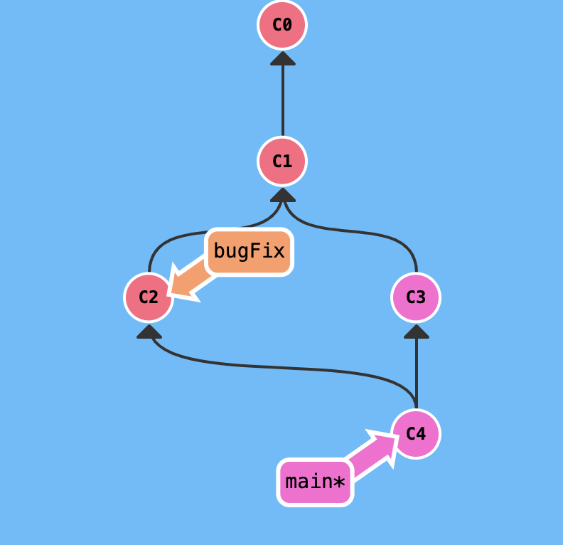

### Überblick

Begriffserklärung:
*Repo*: Repository, alle Dateien aller Branches die Teil eines zu versionierenden Projektverzeichnis stehen

Voraussetzung:
- github Account
- auf github bestehendes, leeres Repository

Nicht jede Datei die zum Repo hinzugefügt oder geändert wird, wird von git berücksichtigt.
Neue Dateien müssen erst über *git add* zum Repo hinzugefügt werden, und über *git commit* werden die von *add* hinzufügten Inhalte tatsächlich erst in die aktuelle Version aufgenommen.

Was ist ein *commit*? Ein commit ist eine Momentaufnahme von Änderungen, die seit dem letzten commit hinzugefügt wurden. (Oder das Füllen eines Repositorys mit seinen Dateien zum allerersten commit.)

### Setup

1. Ordner erstellen, der das Repo sein soll
```
$ mkdir myrepo
$ cd myrepo


$ git init
```

2. Datei erstellen
```
$ touch something.txt
```
Oder auf Windows einfach eine leere Textdatei erstellen.

3. Datei zum staging environment ("Die Bühne") hinzufügen.
```
$ git add something.txt
```

4. commit
```
git commit -m "First commit!"
```
Damit steht die erste Datei in der Versionierung!
Jetzt kommen Branches hinzu.

### Branches
Branches sind Teilversionen oder andere Editionen des Programms, können aber auch nur einzelne Features behandeln.

Branches können auch fusioniert werden (mittels merge) und so zu einer neuen Version verschmelzen.

1. Einen Branch erstellen:
```
$ git branch my_new_branch
$ git checkout my_new_branch
```
oder
```
$ git checkout -b my_new_branch
```

Dadurch wird ein neuer branch namens *my_new_branch* erstellt und auch sogleich auf diesen gewechselt!

2. Branches überprüfen:
```
$ git branch
```


### Repository auf github laden
Der Link zum Repository ist auf Github erhältlich und hat die Form
https://github.com/myname/mynewrepository.git
```
$ git remote add origin https://github.com/myname/mynewrepository.git
$ git push -u origin master
```

Der Link nach remote add origin muss natürlich angepasst werden.

### Pull Request

TODO

### Änderungen vom Remote Repo auf den lokalen Rechner holen
```
$ git pull origin master
```
Updated das lokale Repo auf den Stand des Remote Repos (auf Github, genauer den Stand des branch *master*


### Branches zusammenführen

```
$ git merge bugFix
```


### Befehlsübersicht
- git status: Überblick über aktuelle Änderungen
- git log : Überblick über Author und Inhalt der letzten commits.
- git clone : Lädt ein bereits bestehendes remote Repo herunter

### Konfiguration

Name und E-mail Adresse an die eigenen commits hängen:
```
$ git config --global user.name "[Name]"
$ git config --global user.email "[Email Adresse]"
```
### Quellen
- https://product.hubspot.com/blog/git-and-github-tutorial-for-beginners
- https://training.github.com/downloads/de/github-git-cheat-sheet/
- https://learngitbranching.js.org/?locale=de_DE